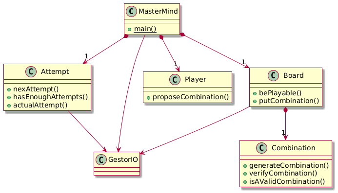

# 🎯 Mastermind - Console Game 🎨

Mastermind is a **code-breaking** game where you must guess a **secret combination of colors** within **10 attempts**.

## 📌 Diagram Class

Below is the class diagram for the Mastermind game:



### 📖 Explanation of the Class Diagram

- **MasterMind** (Main Class)
  - The entry point of the game, containing the `main()` method.
  - It has associations with `Board`, `Player`, `Attempt`, and `GestorIO`.

- **Board**
  - Manages the game board logic.
  - It ensures the game is playable (`bePlayable()`) and manages color combinations (`putCombination()`).
  - Contains a **Composition relationship** with `Combination`.

- **Combination**
  - Handles the secret combination generation (`generateCombination()`).
  - Verifies if a proposed combination is correct (`verifyCombination()`).
  - Checks if a given combination is valid (`isAValidCombination()`).

- **Player**
  - Represents the player and their ability to propose a combination (`proposeCombination()`).

- **Attempt**
  - Manages the number of attempts (`actualAttempt()`, `hasEnoughAttempts()`).
  - Tracks and updates each attempt (`nextAttempt()`).

- **GestorIO**
  - Handles user input and output operations.
  - Connected to multiple components to manage communication between the user and the game logic.

This structure ensures that the game follows a **modular and object-oriented** approach, making it easy to maintain and extend. 🚀🎮

## 🕹️ How to Play  

- The secret combination consists of a sequence of **four colors**, chosen from the following:  

  **red (r) - Blue (B) - Yellow (Y) - Green (G) - Orange (O) - Purple (P)**  

- Enter your guess using the **initials** of the colors in lowercase/uppercase as shown.  
  - Example: `rybg` (red, yellow, blue, green)  

- After each attempt, you will receive **feedback** in the form of black and white pegs:  

## ⚫⚪ Feedback System  

- **⚫ Black Peg:** A color is **correct and in the right position**.  
- **⚪ White Peg:** A color is **correct but in the wrong position**.  
- No peg means the color is **not in the combination**.  

## 🏆 Winning the Game  

You have **10 attempts** to crack the code! Use **logic, deduction, and strategy** to win.  

---

## 🔹 Example Game Session  

```console
----- MASTERMIND -----

0 attempt(s): 
Propose a combination: rybo

1 attempt(s): 
rybo --> 1 blacks and 2 whites.
Propose a combination: brbo

2 attempt(s): 
rybo --> 1 blacks and 2 whites.
brbo --> 3 blacks and 1 whites.
Propose a combination: brgo

You've won!
```

🎯 **Think carefully, analyze your results, and break the code!** Good luck! 🚀  
